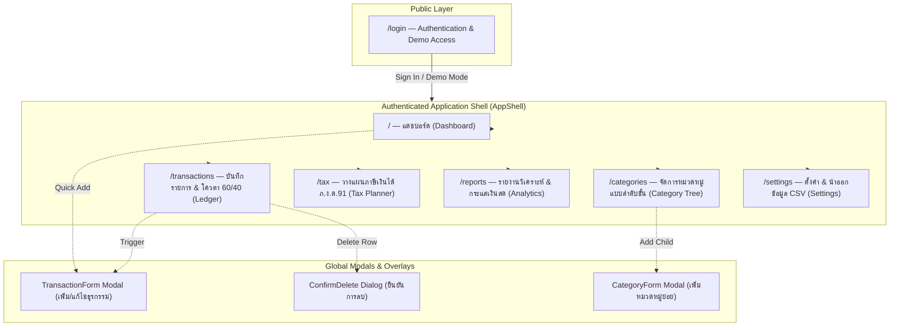
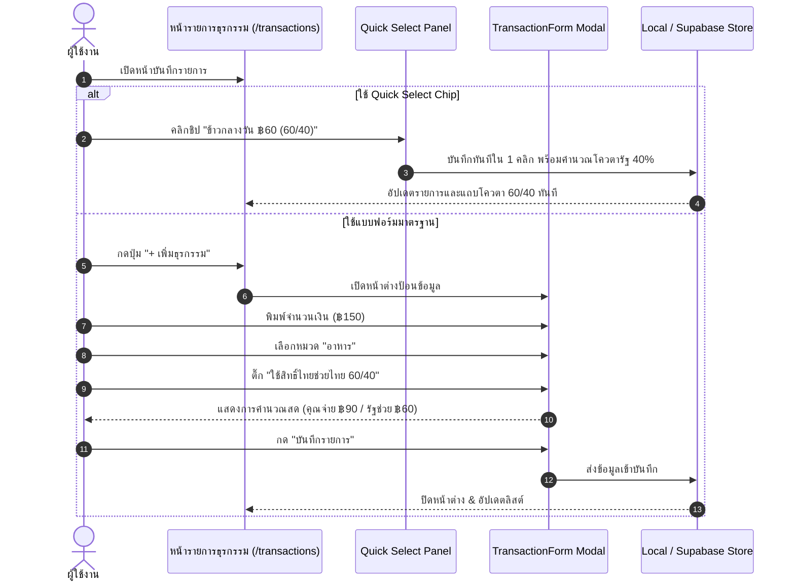
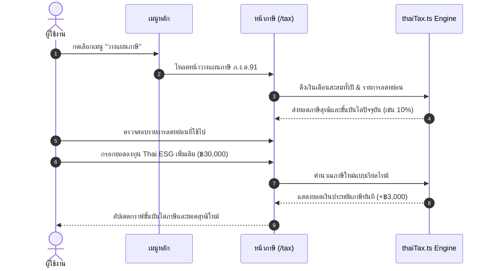

# NgernMee Limited (เงินมี จำกัด) — Website Master Outline & Information Architecture

> **Project:** NgernMee Limited (เงินมี จำกัด)  
> **Type:** Personal Finance Management (PFM) & Tax Planning Web Application  
> **Aesthetic:** Modern Minimalist Fintech (Calm, Quiet Luxury, Clutter-Free)  
> **Tech Stack:** React 19, TypeScript 5, Vite 6, Tailwind CSS 4, Zustand, Supabase / LocalStorage  
> **Target Audience:** Thai salaried employees (มนุษย์เงินเดือน), freelancers/contractors, and retail consumers participating in government economic stimulus programs (Thai Chuay Thai 60/40 Co-Pay).

---

## 1. Executive Summary & Site Vision

NgernMee Limited is designed to transform daily personal finance management from an overwhelming chore into an effortless, friction-free daily routine. Unlike conventional bookkeeping apps that crowd screens with colorful gradients, banner ads, and confusing menus, NgernMee prioritizes:
1. **Zero Cognitive Friction:** Clean white/slate canvas, strict 8-point spatial rhythm, and high-readability typography (Inter + Prompt).
2. **Localization for Thailand:** Native support for Thai Baht (฿), Buddhist Era / Thai solar calendar formatting, Thai Personal Income Tax (PIT / ภ.ง.ด.91) 8-step brackets, and Thai Chuay Thai 60/40 government co-pay allowance tracking.
3. **Frictionless Entry:** 1-click Quick Select chips and an iOS-style segmented modal allowing entries to be logged in under 3 seconds.
4. **Dual Data Architecture:** Runs 100% offline out-of-the-box via LocalStorage (Demo Mode) with seamless instant migration to Supabase Cloud PostgreSQL with Row-Level Security (RLS).

---

## 2. Site Map & Information Architecture (IA)

---

## 3. Global Navigation & Layout Architecture

The application adopts a responsive 3-tier layout shell:

### 3.1 Desktop Viewport (1440px / 1280px Grid)
- **Left Navigation Drawer (`w-64` / 256px Fixed):**
  - **Brand Header:** Sleek Forest Emerald logo mark (`#059669`) + "เงินมี จำกัด" typography + version pill (`v2.0`).
  - **Primary Navigation Links:**
    - `[GridIcon]` แดชบอร์ด (`/`)
    - `[ReceiptIcon]` รายการธุรกรรม (`/transactions`)
    - `[CalculatorIcon]` วางแผนภาษี (`/tax`)
    - `[BarChart3Icon]` รายงานวิเคราะห์ (`/reports`)
    - `[FolderTreeIcon]` หมวดหมู่ (`/categories`)
    - `[SettingsIcon]` ตั้งค่าระบบ (`/settings`)
  - **Bottom Profile Card:** User avatar, name ("คุณ ธนภัทร"), email, and logout icon button.
- **Top Bar Header (`h-14` / 56px Sticky):**
  - Left: Dynamic page title with breadcrumb context.
  - Right: Demo Mode status indicator (`Demo Data` badge) + Quick Add CTA button (`+ บันทึกรายการ`).
- **Main Canvas:** Centered auto-layout with `max-w-7xl` (1280px) and `p-6` margins.

### 3.2 Mobile Viewport (390px iPhone Standard)
- **Sticky Top Bar (`h-14`):** Compact logo, page title, and user profile avatar button.
- **Bottom Navigation Bar (`h-16` Floating Bar with Safe Area):**
  - 5 primary thumb-reachable touch targets:
    1. Dashboard (`/`)
    2. Transactions (`/transactions`)
    3. Center Floating Quick Add Action (`+`)
    4. Tax Planner (`/tax`)
    5. Reports (`/reports`)
  - More settings accessible via Top Bar profile avatar.

---

## 4. Comprehensive Page Outlines & Wireframe Structures

---

### Page 1: Dashboard (`/` — แดชบอร์ดภาพรวม)

**Primary Objective:** Deliver an instant, peaceful, at-a-glance overview of current net liquidity, monthly burn rate, remaining 60/40 government co-pay quota, and recent activity within 5 seconds.

#### Section Hierarchy & Layout:
1. **Header & Greeting Strip:**
   - Left: "สวัสดีคุณ ธนภัทร" (18px SemiBold) + Date eyebrow ("วันเสาร์ที่ 19 กันยายน 2569").
   - Right: "บันทึกรายการด่วน" (Primary Emerald Button with `+` icon).
2. **Top Metric Cards Grid (3 Columns Desktop / 1 Column Mobile):**
   - **Card 1: ยอดเงินคงเหลือรวม (Net Balance):**
     - Eyebrow: `TOTAL BALANCE` + Wallet icon avatar.
     - Big Metric: `฿ 124,580.00` (28px SemiBold Tabular numbers).
     - Subtext: `กระแสเงินสดสุทธิเดือนนี้ +฿26,760.00` (Emerald text).
   - **Card 2: รายรับเดือนนี้ (Monthly Income):**
     - Eyebrow: `THIS MONTH'S INCOME` + ArrowUpRight icon.
     - Big Metric: `฿ 45,000.00` (24px SemiBold).
     - Subtext: `เงินเดือนและรายได้เสริม` (Slate-500 text).
   - **Card 3: รายจ่ายเดือนนี้ (Monthly Expense):**
     - Eyebrow: `THIS MONTH'S EXPENSES` + ArrowDownRight icon.
     - Big Metric: `฿ 18,240.00` (24px SemiBold).
     - Subtext: `40.5% ของรายรับรวม` (Slate-500 text).
3. **Thai Chuay Thai 60/40 Co-Pay Quota Banner Card:**
   - Government co-pay tracking strip:
     - Left: Shield icon + "โควตาโครงการไทยช่วยไทย (รัฐช่วย 40% / คุณจ่าย 60%)".
     - Right: Progress ratio: `฿12,400.00 / ฿40,000.00` (31%).
     - Minimal 6px blue progress bar.
     - 3-column micro breakdown: "คุณจ่าย 60%: ฿7,440" | "รัฐช่วยจ่าย 40%: ฿4,960" | "สิทธิ์คงเหลือ: ฿27,600".
4. **Activity & Breakdown Grid (2 Columns Desktop):**
   - **Left Column (60% width): กราฟสรุปการใช้จ่าย 7 วันล่าสุด (7-Day Sparkline):**
     - Area chart with soft emerald curve and 0.15 fill opacity.
     - Tooltip showing exact daily expense and transaction count.
   - **Right Column (40% width): สัดส่วนค่าใช้จ่ายตามหมวดหมู่ (Category Donut / Progress):**
     - Clean progress bars for top 4 spending categories (e.g., อาหาร 42%, เดินทาง 24%, ที่พัก 18%, อื่นๆ 16%).
5. **Recent Transactions Feed (ธุรกรรมล่าสุด):**
   - Card container with header ("5 รายการล่าสุด" + "ดูทั้งหมด →" link).
   - Clean list rows with merchant avatar, category badge, amount (-฿ / +฿), and timestamp.

---

### Page 2: Transactions & Ledger (`/transactions` — รายการธุรกรรม & โควตา)

**Primary Objective:** High-speed data recording, rapid search, and multidimensional ledger filtering without cognitive fatigue.

#### Section Hierarchy & Layout:
1. **Consolidated Action & Quota Strip:**
   - **Thai Chuay Thai Quota Pill:** Compact badge showing `โควตา 60/40 เดือนนี้: ฿12,400 / ฿40,000`.
   - **Global Action Group:**
     - Search Input (`w-64` / Full-width mobile): Real-time text search for notes, merchants, or amounts.
     - Type Filter Dropdown (`ทั้งหมด`, `รายรับ`, `รายจ่าย`, `เฉพาะไทยช่วยไทย`).
     - "เพิ่มธุรกรรม" (+ Add Transaction Button - Primary Emerald).
2. **Quick Select Panel (ชิปเลือกด่วน 1 วินาที):**
   - Horizontally scrollable row of the user's top 8 most frequent transactions:
     - `[☕ กาแฟสด ฿65]`
     - `[🍜 ข้าวกลางวัน ฿60 (60/40)]`
     - `[🚆 รถไฟฟ้า BTS ฿47]`
     - `[🛒 7-Eleven ฿150 (60/40)]`
     - `[⛽ น้ำมันรถ ฿1,000]`
   - Clicking immediately auto-fills the modal form in 1 click.
3. **Ledger Data Feed (Grouped by Date):**
   - **Date Group Header:** Sticky bar with Thai date (`วันเสาร์ที่ 19 กันยายน 2569`) + Net Daily Total (`รายรับ +฿0.00 / รายจ่าย -฿272.00`).
   - **Transaction Item Rows:**
     - Left: Category icon pill (e.g., Coffee cup, Train, Shopping bag).
     - Middle: Title/Description + Category Breadcrumb (`อาหาร › กาแฟ`) + `[ไทยช่วยไทย 60/40]` pill.
     - Right: Net amount (`-฿ 65.00` in Rose-600 / `+฿ 45,000.00` in Emerald-600) + time (`14:30 น.`).
     - Hover Actions: Edit and Delete icon buttons.
4. **Pagination / Infinite Scroll Indicator:**
   - Shows "แสดง 25 จาก 142 รายการ" + "โหลดเพิ่มเติม".

---

### Page 3: Transaction Entry Modal (`TransactionForm` — แบบฟอร์มบันทึกรายการ)

**Primary Objective:** 3-second recording flow with zero unnecessary input fields.

#### Internal Form Hierarchy:
1. **Modal Header:**
   - Title: "บันทึกรายการใหม่" (Heading/2) + Close button (`✕`).
2. **Segmented Type Switcher (iOS-style Pill):**
   - `[ - รายจ่าย (Expense) ]` | `[ + รายรับ (Income) ]`
3. **Hero Amount Field:**
   - Prominent, large numeric input (`text-3xl font-bold font-mono`).
   - Currency prefix (`฿`).
4. **Category Grid Selector:**
   - 4x2 grid of primary categories with clear icons (อาหาร, เดินทาง, ช้อปปิ้ง, บันเทิง, ค่าใช้จ่ายบ้าน, สุขภาพ, การลงทุน, อื่นๆ).
5. **Thai Chuay Thai 60/40 Co-Pay Section:**
   - Clean toggle card: "ใช้สิทธิ์โครงการไทยช่วยไทย (60/40)".
   - Real-time computation preview:
     - ผู้ใช้จ่ายจริง (60%): `฿ 120.00`
     - รัฐบาลสนับสนุน (40%): `฿ 80.00`
     - โควตารายวันคงเหลือ: `฿ 120.00 / ฿200.00`
6. **Secondary Attributes (2-Column Grid):**
   - Date Picker (Defaults to Current Date/Time).
   - Payment Method / Account (`เงินสด`, `บัตรเครดิต`, `PromptPay / บัญชีธนาคาร`).
7. **Note / Description Input:**
   - Single-line text input with placeholder: "เช่น ค่าอาหารกลางวัน, ค่าน้ำมัน, ช้อปปิ้ง".
8. **Footer Action Bar:**
   - Left: "ยกเลิก" (Ghost Button).
   - Right: "บันทึกรายการ" (Primary Emerald Button).

---

### Page 4: Personal Income Tax Planner (`/tax` — วางแผนภาษีเงินได้ ภ.ง.ด.91)

**Primary Objective:** Eliminate the anxiety of Thai Personal Income Tax by visualizing brackets, computing net tax payable in real time, and recommending actionable deductions.

#### Section Hierarchy & Layout:
1. **Executive Tax Outcome Card (Hero Stat):**
   - Replaced loud multi-color gradients with a structured executive summary:
     - Left: **ประมาณการภาษีที่ต้องชำระสุทธิ (Estimated Net Tax):** `฿ 8,450.00` (Display Bold font).
     - Right: **อัตราภาษีฐานสูงสุด (Current Bracket):** `10% Bracket` (เงินได้สุทธิ ฿350,000).
     - Status tag: `เงินได้ประเมินทั้งปี ฿ 540,000.00 | หักค่าใช้จ่าย & ลดหย่อน ฿ 190,000.00`.
2. **Tax Bracket Visualizer (แถบขั้นบันไดภาษี 8 ระดับ):**
   - Interactive progress meter mapping net income through Revenue Department brackets:
     - 0 - 150,000: ยกเว้นภาษี (0%)
     - 150,001 - 300,000: 5%
     - 300,001 - 500,000: 10% *(Current Bracket indicator)*
     - 500,001 - 750,000: 15%
     - 750,001 - 1,000,000: 20%
     - 1,000,001 - 2,000,000: 25%
     - 2,000,001 - 5,000,000: 30%
     - เกิน 5,000,000: 35%
3. **Deductions & Allowances Checklist (รายการค่าลดหย่อนภาษี):**
   - Grouped into 4 clear functional accordions/cards:
     - **กลุ่ม 1: ค่าใช้จ่ายส่วนตัว & ครอบครัว:**
       - ค่าใช้จ่ายเงินเดือน 50% (สูงสุด 100,000 บาท) — *คำนวณอัตโนมัติ*
       - ค่าลดหย่อนส่วนบุคคล (60,000 บาท) — *คงที่*
       - ค่าลดหย่อนคู่สมรส / บุตร / เลี้ยงดูบิดามารดา
     - **กลุ่ม 2: ประกันชีวิตและสุขภาพ:**
       - ประกันสังคม (สูงสุด 9,000 บาท)
       - ประกันชีวิตทั่วไป & ประกันสุขภาพ (สูงสุด 100,000 บาท)
     - **กลุ่ม 3: การลงทุนระยะยาวเพื่อการเกษียณ:**
       - กองทุนรวมไทยเพื่อความยั่งยืน (Thai ESG: สูงสุด 300,000 บาท)
       - RMF (สูงสุด 500,000 บาท รวมกับกลุ่มเกษียณอื่นๆ)
       - SSF (สูงสุด 200,000 บาท)
     - **กลุ่ม 4: อสังหาริมทรัพย์และมาตรการรัฐ:**
       - ดอกเบี้ยกู้ยืมเพื่อซื้อที่อยู่อาศัย (สูงสุด 100,000 บาท)
       - รายจ่ายตามมาตรการกระตุ้นเศรษฐกิจ
4. **Smart Tax Optimization Advisor (คำแนะนำลดหย่อนภาษี):**
   - 3 actionable suggestion cards:
     - "💡 ลงทุนใน Thai ESG เพิ่มเติมอีก ฿30,000 เพื่อประหยัดภาษีเพิ่ม ฿3,000 (อัตรา 10%)"
     - "🛡️ สิทธิ์ลดหย่อนประกันชีวิตยังเหลือโควตา ฿45,000"
     - "📈 เงินได้สุทธิของคุณอยู่ใกล้จุดตัดฐาน 5% หากลดหย่อนเพิ่ม ฿20,000 จะลดภาษีได้ทันที"

---

### Page 5: Financial Reports & Analytics (`/reports` — รายงานวิเคราะห์การเงิน)

**Primary Objective:** Provide deep monthly and annual intelligence on cashflow health, spending velocity, and category distribution.

#### Section Hierarchy & Layout:
1. **Control & Filter Toolbar:**
   - Month / Year Picker (e.g. `กันยายน 2569` / `ปี 2569 ทั้งปี`).
   - "ส่งออกรายงาน CSV" (Outline Button with Excel UTF-8 BOM download).
2. **Key Financial Performance Indicators (3 Metric Cards):**
   - **อัตราการออม (Savings Rate):** `34.2%` (เป้าหมายมาตรฐาน > 20%).
   - **สัดส่วนค่าใช้จ่ายจำเป็น (Needs vs. Wants):** `52% จำเป็น / 28% ไลฟ์สไตล์ / 20% ออม`.
   - **ค่าใช้จ่ายเฉลี่ยต่อวัน (Daily Burn Rate):** `฿ 608.00 / วัน`.
3. **Analytics Views Tabs:**
   - **View 1: ภาพรวมกระแสเงินสด (Cash Flow Analysis):**
     - Grouped Bar Chart comparing monthly income vs monthly expenses across past 6 months.
   - **View 2: สัดส่วนค่าใช้จ่าย (Spending Distribution):**
     - Clean Donut Chart + Category breakdown table showing percentage, total amount, and monthly change.
   - **View 3: โครงการไทยช่วยไทย (60/40 Co-Pay Report):**
     - Summary of total money saved via government co-pay (e.g. `ประหยัดเงินได้รวม ฿4,960.00 ในปีนี้`).
   - **View 4: ทะเบียนเงินได้และภาษี (Salary & Tax Audit Trail):**
     - Monthly salary records and cumulative tax withholding records.

---

### Page 6: Category Management (`/categories` — จัดการหมวดหมู่)

**Primary Objective:** Allow users to build and customize their personalized expense & income taxonomy with unlimited hierarchical nesting.

#### Section Hierarchy & Layout:
1. **Header & Management Controls:**
   - Title: "จัดการหมวดหมู่รายรับ-รายจ่าย".
   - Segmented Tab Switcher: `[ รายจ่าย (Expense) ]` | `[ รายรับ (Income) ]`.
   - "เพิ่มหมวดหมู่หลัก" (+ New Root Category Button).
2. **Category Tree View (`CategoryTree`):**
   - Interactive tree structure:
     - **Root Category Card (e.g. 🍔 อาหารและเครื่องดื่ม):**
       - Left: Drag handle, Icon, Color indicator dot, Title, Subcategory count badge ("4 หมวดย่อย").
       - Right: "เพิ่มหมวดย่อย" button (+), Edit button, Delete button.
     - **Indented Child Category Cards (e.g. ☕ กาแฟ, 🍜 อาหารประจำวัน, 🍱 ดินเนอร์/ปาร์ตี้):**
       - Indented tree connector line (`border-l-2 border-slate-200`).
       - Individual subcategory badge and quick delete.
3. **Category Form Modal (`CategoryForm`):**
   - Category Name (Thai / English).
   - Parent Category Selector (Root or nested under existing category).
   - Icon Picker (Curated Lucide icon set: food, transport, house, wallet, gift, health, etc.).
   - Color Swatch Selector (8 minimalist semantic tones).

---

### Page 7: Settings & Data Management (`/settings` — ตั้งค่าระบบ & ข้อมูล)

**Primary Objective:** Give users complete transparency, security control, and effortless backup/export capabilities.

#### Section Hierarchy & Layout:
1. **Account & Storage Status:**
   - Current Mode Banner:
     - When using LocalStorage: Displays "โหมดทดลองใช้งานออฟไลน์ (Local Demo Mode)" with button to connect Supabase Cloud.
     - When connected to Supabase: Displays "เชื่อมต่อคลาวด์ปลอดภัย (Supabase PostgreSQL / RLS Active)".
2. **General Preferences:**
   - Currency: Thai Baht (`THB (฿)`) default.
   - Calendar Format: พุทธศักราช (พ.ศ.) / คริสต์ศักราช (ค.ศ.).
   - Theme Toggle: `Light Mode` / `Dark Mode` / `System Preference`.
3. **Data Backup & Export:**
   - "ส่งออกประวัติรายการทั้งหมด (CSV)": Downloads Excel-ready UTF-8 BOM file.
   - "ส่งออกสรุปรายงานภาษีประจำปี (CSV)".
4. **Danger Zone & Data Reset:**
   - "ล้างข้อมูลและโหลดชุดข้อมูลตัวอย่างใหม่ (Reset to Demo Seed)": Resets local database to clean state.
   - "ลบข้อมูลทั้งหมดอย่างถาวร (Factory Reset)".

---

### Page 8: Authentication & Access Gate (`/login` — เข้าสู่ระบบ)

**Primary Objective:** Fast sign-in for cloud users, with instant zero-friction demo access for first-time visitors.

#### Section Hierarchy & Layout:
1. **Minimal Brand Header:**
   - Solid Forest Emerald logo badge (`#059669`) + "เงินมี จำกัด".
   - Subtitle: "ระบบบันทึกรายรับ-รายจ่ายและวางแผนภาษีอัจฉริยะ".
2. **Sign In Form Card:**
   - Email Input.
   - Password Input.
   - "เข้าสู่ระบบ" (Primary Emerald Button).
3. **Zero-Friction Demo Access Action:**
   - Divider: "หรือทดลองใช้งานทันทีโดยไม่ต้องลงทะเบียน".
   - "ทดลองใช้งาน Demo Mode" (Secondary Outline Button with ArrowRight).
   - Explanatory note: "ข้อมูลจะถูกบันทึกในเบราว์เซอร์ของคุณอย่างปลอดภัย และสามารถเชื่อมต่อคลาวด์ได้ในภายหลัง".

---

## 5. Core User Journeys & Navigation Flows

### Journey A: 3-Second Daily Expense Log (With 60/40 Co-Pay)

### Journey B: Year-End Tax Planning & Deduction Optimization

---

## 6. Technical Route Map & Data Contract Summary

| URL Route | Page Component | Access Type | Primary Data Stores | Key Functions |
| :--- | :--- | :--- | :--- | :--- |
| `/login` | `LoginPage` | Public | `useAuthStore` | Sign-in, sign-up, switch to offline demo |
| `/` | `DashboardPage` | Protected | `useTransactionStore`, `useCategoryStore` | Cashflow overview, 7-day sparkline, 60/40 status |
| `/transactions` | `TransactionsPage` | Protected | `useTransactionStore`, `useCategoryStore` | Ledger history, Quick Select, date grouping |
| `/tax` | `TaxPage` | Protected | `useTaxStore`, `useTransactionStore` | PIT 8-bracket simulation, deductions checklist |
| `/reports` | `ReportsPage` | Protected | `useTransactionStore`, `useCategoryStore` | Multi-view analytics, savings rate, CSV export |
| `/categories` | `CategoriesPage` | Protected | `useCategoryStore` | Hierarchical tree editor, icon & color picker |
| `/settings` | `SettingsPage` | Protected | `useAuthStore`, `useTransactionStore` | Profile, sync status, Excel CSV export, reset |

---

*Authored for NgernMee Limited by Antigravity Design & Engineering Team.*
